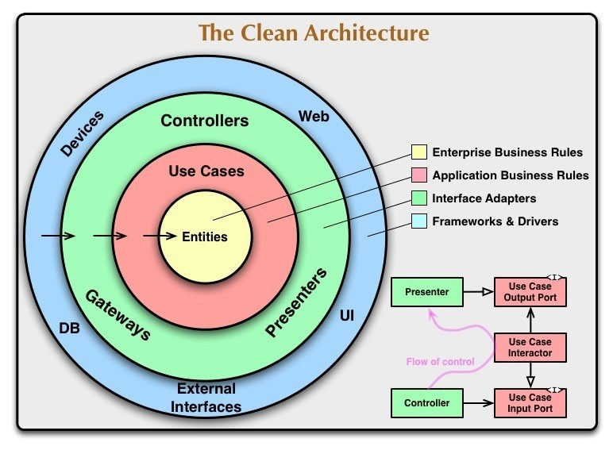

# Clean architecture

- As linhas horizontais representam o fluxo de dependência, ou seja, um círculo mais ao interior não pode depender de um círculo exterior a ele. Nesse caso temos: 
  - Entidades não dependem de ninguém e armazenam as informações de negócio.  (**Camada com as regras de negócio e chamada aos dados**) (**Camada data**)
  - Use Cases dependem das entidades para realizar o fluxo de negócio (**Camada com as regras de negócio do nivel de aplicação**) (**Camada domain**)
  - Por fim, temos a camada de apresentação com os controllers e a própria view em si. (**Interface adapters**)

---

# Clean Architecture & Flutter

- A comunidade do Reso coder disponibilizou uma proposta de arquitetura limpa que se encaixa no mundo do flutter/dart.

---

# Explanation & Project Organization

- Cada "feature" do aplicativo, por exemplo pegar algum dado "trivia" de um número, será dividio em 3 camadas (presentation, domain e data) 

- Mais informações: https://resocoder.com/2019/08/27/flutter-tdd-clean-architecture-course-1-explanation-project-structure/